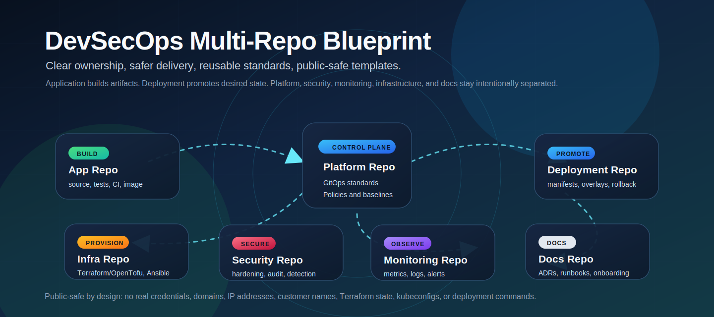

# DevSecOps Multi-Repo Architecture Blueprint



This repository is a public-safe blueprint for designing, documenting, and operating a professional DevSecOps multi-repository model. It is intended to be used as a portfolio/reference repository and as an internal standard for future client or product implementations.

It complements real platform implementation repositories, such as a Kubernetes platform repository, but it does not depend on them directly. This repo defines the operating model, templates, boundaries, checklists, and example flows that can be adapted into real projects.

## Who This Is For

- Platform and DevOps engineers designing repeatable delivery standards.
- Security engineers defining safe repository boundaries and quality gates.
- Application teams that need clear rules for CI, image creation, and deployment handoff.
- Engineering leaders who need a consistent client onboarding and repository split model.
- Portfolio reviewers who want to understand how infrastructure, delivery, security, and operations are separated.

## Why Multi-Repo Separation Matters

A single repository for application code, infrastructure provisioning, production deployment manifests, and operations documentation creates unnecessary risk. Multi-repo separation reduces blast radius and makes ownership explicit.

The core separation model is:

- Application repositories own source code, tests, local development, CI, and image publishing.
- Deployment repositories own runtime manifests, GitOps definitions, environment overlays, and promotion history.
- Infrastructure repositories own Terraform/OpenTofu, Ansible, provisioning flows, and state-management documentation.
- Platform repositories own reusable platform components, GitOps standards, policies, and observability baselines.
- Security repositories own hardening baselines, security automation, audit rules, and node onboarding checks.
- Monitoring repositories own observability configuration, dashboards, alert routing, and telemetry standards.
- Documentation repositories own architecture, onboarding, runbooks, decision records, and operational procedures.

## Public and Private Boundaries

This blueprint is safe for public use because it contains only templates, examples, and placeholder values. Real implementation repositories must still separate public-shareable documentation from private operational details.

Public-safe content includes:

- generic architecture diagrams
- repository templates
- checklists and process documentation
- placeholder examples
- tool references and implementation guidance

Private content must stay out of this blueprint:

- real credentials, keys, tokens, or certificates
- real customer names, domains, IP addresses, or infrastructure identifiers
- production kubeconfig files
- Terraform state files
- Ansible vault files
- provider account identifiers
- client-specific incident history or topology

## Recommended Repository Model

For a typical project, start with this repository set:

```text
<project>-app
<project>-deployment
<project>-infra
<project>-platform
<project>-security
<project>-monitoring
<project>-docs
```

Smaller projects may combine platform, security, and monitoring standards into a shared internal platform repository. Larger organizations should keep them separate so ownership and access control remain clear.

See:

- [Documentation Index](docs/index.md)
- [Recommended Repositories](docs/architecture/recommended-repos.md)
- [Repository Separation Model](docs/architecture/repo-separation-model.md)
- [Public/Private Boundary](docs/security/public-private-boundary.md)

## How To Use The Templates

Use `repo-templates/` as starter scaffolding, not as production-ready implementation code.

1. Pick the repo template that matches the target repository type.
2. Copy only the relevant folders into the new repository.
3. Replace placeholder names with project-safe generic names first.
4. Add real environment values only inside the real private implementation repository.
5. Keep runtime deployment ownership in the deployment repository unless the application repository only needs minimal development examples.
6. Add quality gates before connecting real deployment automation.
7. Review the repository sanitization checklist before publishing or sharing externally.

## Suggested Implementation Order

1. Create the documentation repository and capture naming, access, and ownership rules.
2. Create the application repository with tests, local development docs, CI, and image scanning.
3. Create the deployment repository with environment overlays and promotion rules.
4. Create the infrastructure repository with provisioning boundaries and state-management rules.
5. Create the platform repository for reusable GitOps, policies, and observability standards.
6. Create security and monitoring repositories when those responsibilities need independent lifecycle control.
7. Add release readiness, rollback, incident response, and support boundary documentation.

## What This Repository Does Not Contain

This repository intentionally does not contain:

- live infrastructure code wired to real providers
- deployment commands or automation that changes external systems
- real secrets, credentials, tokens, domains, IP addresses, or customer identifiers
- production Terraform state, kubeconfig files, or Ansible vaults
- client-specific runbooks or incident data
- a direct dependency on any specific platform implementation repository

## Repository Map

```text
docs/
  architecture/
  ci-cd/
  client-onboarding/
  gitops/
  operations/
  quality-gates/
  security/
  tooling/
repo-templates/
  app-repo/
  deployment-repo/
  docs-repo/
  infra-repo/
  monitoring-repo/
  platform-repo/
  security-repo/
```

Start with [docs/review/repo-review.md](docs/review/repo-review.md) after reviewing the full repository.
