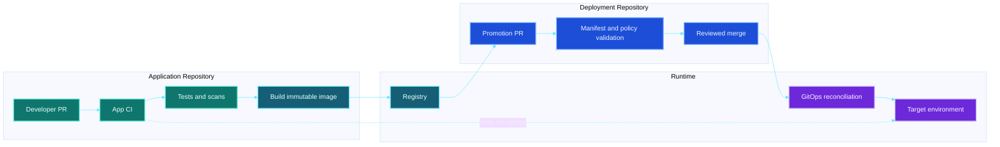

# CI/CD Boundaries

Application CI creates validated artifacts. Deployment CD promotes approved artifacts through reviewed desired-state changes.

```mermaid
%%{init: {"theme": "base", "themeVariables": {"background": "#08111f", "primaryTextColor": "#e5f3ff", "lineColor": "#67e8f9", "fontFamily": "Arial"}}}%%
flowchart LR
  subgraph Build["Application Repository"]
    Dev[Developer PR] --> CI[App CI]
    CI --> Tests[Tests and scans]
    Tests --> Image[Build immutable image]
  end

  subgraph Promote["Deployment Repository"]
    PR[Promotion PR]
    Validate[Manifest and policy validation]
    Merge[Reviewed merge]
  end

  subgraph Runtime["Runtime"]
    Registry[Registry]
    GitOps[GitOps reconciliation]
    Env[Target environment]
  end

  Image --> Registry
  Registry --> PR
  PR --> Validate
  Validate --> Merge
  Merge --> GitOps
  GitOps --> Env

  CI -. does not deploy .-> Env

  classDef app fill:#0f766e,stroke:#5eead4,color:#ecfeff,stroke-width:2px
  classDef artifact fill:#155e75,stroke:#67e8f9,color:#ecfeff,stroke-width:2px
  classDef deploy fill:#1d4ed8,stroke:#93c5fd,color:#eff6ff,stroke-width:2px
  classDef runtime fill:#6d28d9,stroke:#c4b5fd,color:#faf5ff,stroke-width:2px
  classDef warning fill:#7f1d1d,stroke:#fca5a5,color:#fff1f2,stroke-width:2px,stroke-dasharray: 6 4

  class Dev,CI,Tests app
  class Image,Registry artifact
  class PR,Validate,Merge deploy
  class GitOps,Env runtime
```
