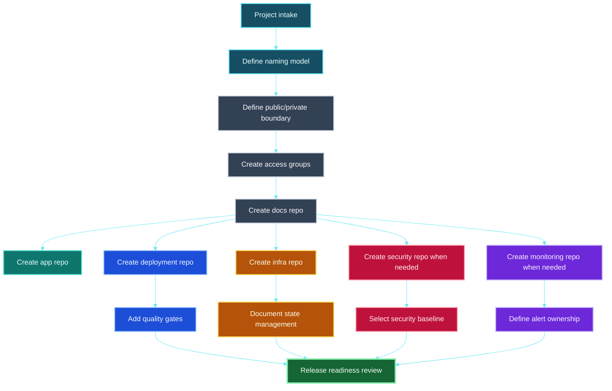

# Client Onboarding Flow

Client onboarding starts with ownership and boundaries before any real environment values are added.

```mermaid
%%{init: {"theme": "base", "themeVariables": {"background": "#08111f", "primaryTextColor": "#e5f3ff", "lineColor": "#67e8f9", "fontFamily": "Arial"}}}%%
flowchart TD
  Intake[Project intake] --> Naming[Define naming model]
  Naming --> Boundary[Define public/private boundary]
  Boundary --> Access[Create access groups]
  Access --> Docs[Create docs repo]

  Docs --> App[Create app repo]
  Docs --> Deploy[Create deployment repo]
  Docs --> Infra[Create infra repo]
  Docs --> Security[Create security repo when needed]
  Docs --> Monitoring[Create monitoring repo when needed]

  Deploy --> Gates[Add quality gates]
  Infra --> State[Document state management]
  Security --> Baseline[Select security baseline]
  Monitoring --> Alerts[Define alert ownership]
  Gates --> Review[Release readiness review]
  State --> Review
  Baseline --> Review
  Alerts --> Review

  classDef intake fill:#164e63,stroke:#67e8f9,color:#ecfeff,stroke-width:2px
  classDef control fill:#334155,stroke:#cbd5e1,color:#f8fafc,stroke-width:2px
  classDef app fill:#0f766e,stroke:#5eead4,color:#ecfeff,stroke-width:2px
  classDef deploy fill:#1d4ed8,stroke:#93c5fd,color:#eff6ff,stroke-width:2px
  classDef infra fill:#b45309,stroke:#fcd34d,color:#fffbeb,stroke-width:2px
  classDef security fill:#be123c,stroke:#fda4af,color:#fff1f2,stroke-width:2px
  classDef monitoring fill:#6d28d9,stroke:#c4b5fd,color:#faf5ff,stroke-width:2px
  classDef review fill:#166534,stroke:#86efac,color:#f0fdf4,stroke-width:3px

  class Intake,Naming intake
  class Boundary,Access,Docs control
  class App app
  class Deploy,Gates deploy
  class Infra,State infra
  class Security,Baseline security
  class Monitoring,Alerts monitoring
  class Review review
```
