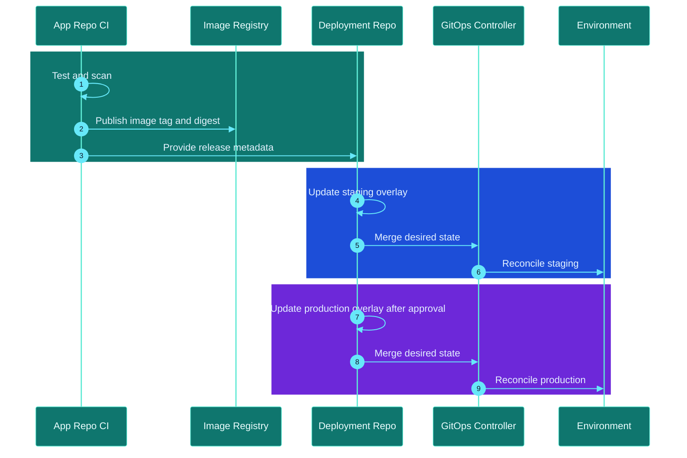

# GitOps Promotion Flow

Promotion is a Git history event in the deployment repository, not a direct deployment from the application pipeline.

```mermaid
%%{init: {"theme": "base", "themeVariables": {"background": "#08111f", "primaryTextColor": "#e5f3ff", "actorBkg": "#0f766e", "actorBorder": "#5eead4", "actorTextColor": "#ecfeff", "activationBkgColor": "#1d4ed8", "activationBorderColor": "#93c5fd", "sequenceNumberColor": "#0f172a", "lineColor": "#67e8f9", "signalColor": "#67e8f9", "signalTextColor": "#e5f3ff", "fontFamily": "Arial"}}}%%
sequenceDiagram
  autonumber
  participant App as App Repo CI
  participant Reg as Image Registry
  participant Dep as Deployment Repo
  participant GitOps as GitOps Controller
  participant Env as Environment

  rect rgb(15, 118, 110)
  App->>App: Test and scan
  App->>Reg: Publish image tag and digest
  App->>Dep: Provide release metadata
  end
  rect rgb(29, 78, 216)
  Dep->>Dep: Update staging overlay
  Dep->>GitOps: Merge desired state
  GitOps->>Env: Reconcile staging
  end
  rect rgb(109, 40, 217)
  Dep->>Dep: Update production overlay after approval
  Dep->>GitOps: Merge desired state
  GitOps->>Env: Reconcile production
  end
```
