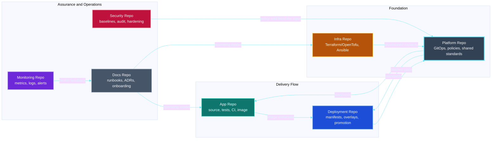

# Multi-Repo Model

This diagram shows the recommended repository split and the primary ownership boundary for each repository type.

```mermaid
%%{init: {"theme": "base", "themeVariables": {"background": "#08111f", "primaryTextColor": "#e5f3ff", "lineColor": "#67e8f9", "fontFamily": "Arial"}}}%%
flowchart LR
  subgraph Delivery["Delivery Flow"]
    App[App Repo<br/>source, tests, CI, image]
    Deploy[Deployment Repo<br/>manifests, overlays, promotion]
  end

  subgraph Foundation["Foundation"]
    Infra[Infra Repo<br/>Terraform/OpenTofu, Ansible]
    Platform[Platform Repo<br/>GitOps, policies, shared standards]
  end

  subgraph Assurance["Assurance and Operations"]
    Security[Security Repo<br/>baselines, audit, hardening]
    Monitoring[Monitoring Repo<br/>metrics, logs, alerts]
    Docs[Docs Repo<br/>runbooks, ADRs, onboarding]
  end

  App -->|image metadata| Deploy
  Deploy -->|desired state| Platform
  Infra -->|provisioned capacity| Platform
  Security -->|policy and baseline input| Platform
  Monitoring -->|health feedback| Docs
  Platform -->|standards| App
  Platform -->|standards| Deploy
  Docs -->|operating model| App
  Docs -->|operating model| Infra

  classDef app fill:#0f766e,stroke:#5eead4,color:#ecfeff,stroke-width:2px
  classDef deploy fill:#1d4ed8,stroke:#93c5fd,color:#eff6ff,stroke-width:2px
  classDef infra fill:#b45309,stroke:#fcd34d,color:#fffbeb,stroke-width:2px
  classDef platform fill:#334155,stroke:#67e8f9,color:#f8fafc,stroke-width:3px
  classDef security fill:#be123c,stroke:#fda4af,color:#fff1f2,stroke-width:2px
  classDef monitoring fill:#6d28d9,stroke:#c4b5fd,color:#faf5ff,stroke-width:2px
  classDef docs fill:#475569,stroke:#cbd5e1,color:#f8fafc,stroke-width:2px
  classDef group fill:#0f172a,stroke:#334155,color:#e2e8f0,stroke-width:1px

  class App app
  class Deploy deploy
  class Infra infra
  class Platform platform
  class Security security
  class Monitoring monitoring
  class Docs docs
```
