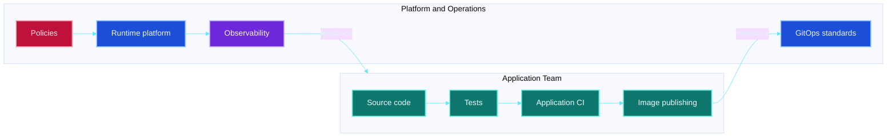

# Platform vs App Responsibility

This diagram clarifies which concerns belong to app teams and which belong to platform or operations teams.

```mermaid
%%{init: {"theme": "base", "themeVariables": {"background": "#08111f", "primaryTextColor": "#e5f3ff", "lineColor": "#67e8f9", "fontFamily": "Arial"}}}%%
flowchart LR
  subgraph AppTeam[Application Team]
    Source[Source code]
    Tests[Tests]
    AppCI[Application CI]
    Image[Image publishing]
  end

  subgraph PlatformTeam[Platform and Operations]
    GitOps[GitOps standards]
    Policies[Policies]
    Runtime[Runtime platform]
    Observability[Observability]
  end

  Source --> Tests --> AppCI --> Image
  Image -->|metadata| GitOps
  Policies --> Runtime
  Runtime --> Observability
  Observability -->|feedback| AppTeam

  classDef app fill:#0f766e,stroke:#5eead4,color:#ecfeff,stroke-width:2px
  classDef platform fill:#1d4ed8,stroke:#93c5fd,color:#eff6ff,stroke-width:2px
  classDef security fill:#be123c,stroke:#fda4af,color:#fff1f2,stroke-width:2px
  classDef observe fill:#6d28d9,stroke:#c4b5fd,color:#faf5ff,stroke-width:2px

  class Source,Tests,AppCI,Image app
  class GitOps,Runtime platform
  class Policies security
  class Observability observe
```
