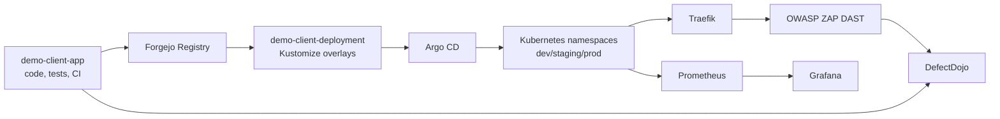

# Building a Production-Shaped E2E DevSecOps Platform Lab with Kubernetes, Forgejo, Argo CD, Traefik, DefectDojo, and Prometheus

## Problem Statement

Many DevOps labs show a happy path: build an image, apply a manifest, and call it production-like. That misses the real work. A B2B platform needs repository boundaries, traceable releases, security evidence, observability, rollback, and clear ownership.

This lab is manual-first, but not toy-first. The point is to understand every operational handoff before automating it.

## Architecture

## Repository Split

The platform repository owns standards. The app repository owns source code and image creation. The deployment repository owns runtime desired state. Infrastructure and docs repositories become separate when their lifecycle and access control need it.

This split reduces blast radius and makes audits easier.

## CI Flow

Forgejo Actions runs tests, secret scanning, SAST, SCA, image build, image scan, report upload, and image push. Reports are imported into DefectDojo so findings become trackable work, not forgotten CI logs.

## CD Flow

The learning lab uses manual deployment repo image updates first. This teaches promotion. Later, CI can update the deployment repo automatically, but production still needs manual approval.

## Security Flow

The lab introduces layered controls:

- non-root containers
- restricted security contexts
- NetworkPolicy
- image scanning
- DAST
- auditd baseline
- Kyverno audit policies
- DefectDojo finding ownership

## Observability Flow

Prometheus, Grafana, and Alertmanager validate that a release is not only deployed but operating. Observability is part of DevSecOps because a release without health evidence is incomplete.

## Environment Strategy

Staging comes first. It validates the full E2E path. Dev comes second for faster iteration. Production comes last after approval gates, rollback, security review, DAST, DefectDojo, and alerting are proven.

## Why Manual-First Does Not Mean Toy Lab

Manual-first means deliberate learning. The manifests, overlays, gates, and repository boundaries are production-shaped from day one. The operator performs each step manually before automating it.

## How This Becomes Production-Ready

Production readiness requires:

- immutable image tags or digests
- no `latest`
- separate production namespace and secrets
- release approval
- successful staging evidence
- rollback runbook
- monitoring and alerts
- reviewed DefectDojo findings
- documented risk acceptance

## Lessons Learned

- CI creates artifacts; CD promotes desired state.
- GitOps needs Git, not local files.
- Security evidence must be stored and reviewed.
- Observability is a release gate.
- Automation should follow understanding, not replace it.

## What This Demonstrates For B2B Clients

This lab demonstrates platform thinking: repeatable repository structure, secure defaults, operational visibility, release discipline, and a clear path from manual validation to automated client rollout.

## Next Improvements

- Add image signing.
- Add SBOM provenance.
- Add External Secrets Operator.
- Add cert-manager when certificate needs outgrow Traefik ACME.
- Add policy enforcement after audit mode is stable.
