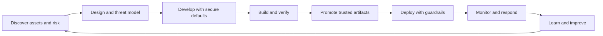

# DevSecOps Principles

## Purpose

DevSecOps is an operating model that integrates security into product design, software development, delivery, infrastructure, and operations. It is not a single tool, pipeline stage, or security-team handoff.

The objective is to make secure delivery repeatable: prevent avoidable weaknesses, find material risk early, protect the path to production, detect runtime threats, and route remediation to the team that owns the affected asset.

This blueprint is a reference pattern. Each implementation must adapt controls, severity, evidence, ownership, and rollout to its architecture and risk.

## Lifecycle

## Principles Followed by This Blueprint

1. **Security is shared, ownership is explicit.** Everyone contributes, but every control, asset, vulnerability, alert, exception, and risk decision still needs a named owner.
2. **Architecture and discovery precede tools.** Understand assets, data, trust boundaries, exposure, delivery paths, and operating constraints before selecting scanners, a WAF, SIEM, policy engine, or platform.
3. **Secure by design and by default.** Reduce attack surface, use least privilege, deny unsafe defaults, isolate trust zones, and make the safe path the easiest path.
4. **Shift left and extend right.** Design review, secure coding, and pull-request feedback complement deployment controls, runtime monitoring, incident response, and recovery.
5. **Automate repeatable decisions.** Use native validation and policy as code for deterministic requirements; keep human review for architecture, business context, exceptions, and risk acceptance.
6. **Build once and promote immutable artifacts.** Separate source, build, and deployment authority; identify artifacts by digest and preserve provenance where supported.
7. **Prioritize contextual risk, not raw scanner counts.** Consider exploitability, internet exposure, asset and data criticality, reachability, compensating controls, and blast radius.
8. **Separate detection from remediation ownership.** A security or platform tool may discover a problem, but the team that owns the code, dependency, image, manifest, identity, or infrastructure normally owns the fix.
9. **Treat exceptions as expiring risk decisions.** Exceptions require scope, owner, approver, justification, compensating controls, evidence, expiry, and a removal plan.
10. **Measure outcomes and control health.** Track coverage, time to triage and remediate, recurring root causes, false positives, expired exceptions, bypasses, and failed or skipped checks.
11. **Prefer evidence over assurance language.** Record what was tested, when, with which version and result. Do not convert a passing scanner into a claim that the system is secure or compliant.
12. **Keep public examples sanitized.** Real topology, accounts, customer identifiers, vulnerabilities, incidents, approvals, credentials, and environment evidence belong in private systems.

## DevSecOps Is Not

- installing Wazuh, a WAF, EDR, CSPM, or vulnerability scanner;
- adding one security job at the end of CI;
- making one DevSecOps engineer responsible for every vulnerability;
- blocking every finding regardless of context;
- replacing secure design, code review, patching, testing, incident response, or business risk ownership;
- a compliance certificate.

## Practical Outcomes

A functioning implementation should make it possible to answer:

- What assets, data, identities, endpoints, dependencies, and environments exist?
- Which team owns each one and who can accept residual risk?
- Which controls run at design, commit, build, promotion, deployment, and runtime?
- Which findings block, warn, create a ticket, or require human review?
- How are vulnerabilities prioritized, assigned, verified, and closed?
- How are alerts triaged and escalated without creating alert fatigue?
- Which evidence proves that a control ran, and which checks were skipped?

See [DevSecOps Responsibility Model](../governance/devsecops-responsibility-model.md), [Framework Alignment](../governance/framework-alignment.md), and [Research and Standards](../references/research-and-standards.md).
