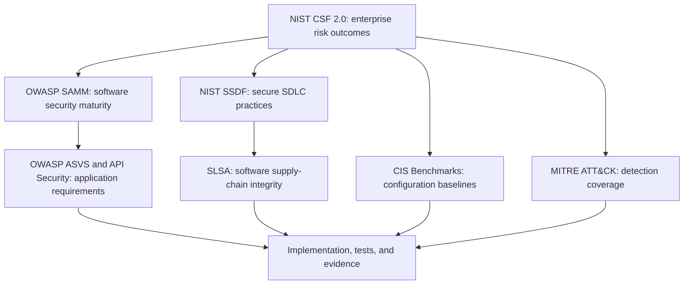

# Security Framework Alignment

## Purpose and Claim Boundary

This blueprint is informed by established security frameworks and standards. It does not claim certification, compliance, complete control implementation, or conformance for any real environment.

Framework selection must follow discovery of business risk, architecture, data, applicable regulation, contractual requirements, and team capability. Record exact versions in each private implementation and reassess them periodically.

## Reference Frameworks

| Framework or standard | How this blueprint uses it | Primary repository areas |
| --- | --- | --- |
| NIST Cybersecurity Framework 2.0 | Governance and risk outcomes across Govern, Identify, Protect, Detect, Respond, and Recover | operating model, roadmap, access, monitoring, incident response |
| NIST SP 800-218 SSDF 1.1 | Secure software-development practices and a common SDLC vocabulary | application CI, security gates, repository boundaries, verification |
| OWASP SAMM 2 | Maturity assessment and staged improvement across governance, design, implementation, verification, and operations | assessment roadmap, ownership, architecture, quality gates |
| OWASP ASVS 5.0.0 | Risk-adapted application security requirements and verification criteria | secure development and application testing; not fully encoded in this blueprint |
| OWASP Top 10:2025 | Awareness of common web-application risk categories | training, secure coding, scanner coverage, threat modeling |
| OWASP API Security Top 10:2023 | API-specific design and verification risks such as object authorization and inventory | endpoint inventory, API threat modeling, application remediation |
| SLSA 1.2 | Incremental software supply-chain integrity, trusted builds, provenance, and promotion expectations | CI/CD boundaries, immutable artifacts, release workflow |
| CIS Benchmarks | Target-specific secure-configuration baselines for selected operating systems, cloud, Docker, and Kubernetes | infrastructure, platform, container, and host hardening |
| MITRE ATT&CK v19 | Detection taxonomy and adversary-behavior mapping | Wazuh rules, SIEM triage, detection coverage |

Use framework identifiers only when the requirement and version have been checked. Avoid superficial control mapping that provides no implementation or evidence.

## How the Frameworks Work Together

- NIST CSF provides the high-level risk-management language.
- SAMM helps assess current and target software-security maturity.
- SSDF describes secure-development practices that can be integrated into the SDLC.
- ASVS and API Security guidance translate application risk into requirements and tests.
- SLSA focuses on source and build supply-chain integrity.
- CIS Benchmarks provide technology-specific hardening guidance.
- MITRE ATT&CK supports threat-informed detection, not preventive-control compliance.

## Current Blueprint Coverage

Implemented as reusable reference patterns:

- multi-repository ownership and access boundaries;
- CI/CD and GitOps promotion separation;
- security and quality gates;
- policy-as-code lifecycle, tests, rollout, and exceptions;
- Terraform/Ansible, Kubernetes, platform, monitoring, and security templates;
- public/private information boundaries and sanitization checks;
- Wazuh/SIEM architecture, WAF log integration, rule tuning, triage, retention, and ownership;
- incident, support, rollback, and release-readiness guidance;
- architecture decision records and implementation roadmap.

Partially covered or intentionally deferred:

- a formal SAMM-based assessment workbook and target maturity profile;
- application-specific threat models and ASVS requirement selection;
- complete SAST, SCA, DAST, secret, API, and IaC scanner implementations;
- signed artifact, SBOM, provenance, and verification workflow examples;
- repository-host rulesets, identity-provider policy, and production access configuration;
- environment-specific CIS assessment and remediation profiles;
- live SIEM, WAF, cloud, EDR, or incident-response validation;
- regulatory and contractual control mapping.

## Adoption Rules

1. Select only applicable controls and document why.
2. Assign an owner, evidence source, enforcement point, and review cadence.
3. Start important automated controls in audit mode before blocking, unless immediate enforcement is justified.
4. Test positive, negative, boundary, and exception behavior.
5. Record skipped and unsupported checks explicitly.
6. Review framework and tool versions before implementation or upgrade.
7. Keep real evidence, findings, exceptions, and mappings private.

See [Research and Standards](../references/research-and-standards.md) for primary sources and [ADR-008](../architecture/decision-records/ADR-008-risk-based-devsecops-framework-alignment.md) for the decision record.
