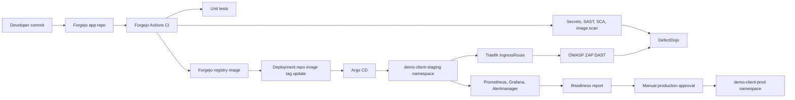

# E2E Kubernetes DevSecOps Lab Guide

## Overview

This guide explains how to build a production-shaped DevSecOps Kubernetes lab manually before automating it. The goal is not to create a disposable toy lab. The goal is to practice the exact delivery model that can later become a reusable B2B client platform standard.

The lab starts with staging because staging validates the complete flow end to end without pretending that production is ready. Dev comes second for faster iteration after the core flow works. Production comes last and only after rollback, observability, security gates, DAST, and release approval are proven.

## Architecture



## What We Are Building

- A platform repository that owns templates, docs, ADRs, scripts, policies, and examples.
- A `demo-client-app` repository for app code, tests, Dockerfile, Forgejo Actions, scans, and image publishing.
- A `demo-client-deployment` repository for Kubernetes manifests, Kustomize overlays, Traefik routing, Argo CD Applications, and runbooks.
- Optional later `demo-client-infrastructure` and `demo-client-docs` repositories.
- A manual E2E deployment flow that becomes automatable only after the operator understands every step.

## Readiness Labels Used In This Guide

Every major step is marked with one of these labels:

| Label | Meaning |
|---|---|
| Required for learning lab | Do this to understand and validate the end-to-end flow manually. |
| Required for staging | Do this before staging can be treated as a reliable pre-production environment. |
| Required for production | Do this before any production deployment or promotion. |
| Optional advanced production hardening | Do later when the baseline flow is stable and the team is ready to operate the extra tool. |

## Why Production-Shaped But Manual-First

Manual-first means you learn the moving parts before hiding them behind automation. Production-shaped means the files already use the same boundaries, namespaces, security controls, observability expectations, and release gates that a real implementation needs.

Do now:

- Build the app image.
- Run CI checks.
- Push image to Forgejo registry.
- Manually update the staging deployment image tag.
- Sync staging with Argo CD.
- Run DAST and observability checks.
- Write a readiness report.

Postpone:

- Automatic deployment repo updates.
- Production promotion.
- cert-manager unless Traefik ACME is insufficient.
- Vault, External Secrets Operator, image signing, and SBOM provenance until the basic flow is proven.

Why:

- Automation without understanding creates fragile systems.
- Production promotion without staging evidence is not a release process.
- Security controls should start in audit/visibility mode before enforcement.

## Repository Split

The app repo owns source code and image creation. The deployment repo owns runtime desired state. The platform repo owns standards. Infrastructure and docs repos are optional until the lab grows.

This split matters because CI and CD have different risks. Application CI can build and scan images. Deployment CD changes live runtime state. Keeping those separate gives clearer ownership, auditability, and rollback.

## Why App CI And Deployment CD Are Separated

Application CI answers: is this code safe enough to package?

Deployment CD answers: should this exact package run in this exact environment?

Do not let application CI directly mutate staging or production. The deployment repository must remain the audit trail for environment state. This makes rollback simple: revert the deployment repo image tag or sync a previous known-good commit.

## Environment Model

Use the same cluster for the lab, with isolated namespaces:

- `demo-client-dev`
- `demo-client-staging`
- `demo-client-prod`

Staging first:

- Required for learning lab.
- Validates the full E2E DevSecOps path.
- Lets you prove registry, Argo CD, Traefik, observability, DAST, and DefectDojo.

Dev second:

- Required for staging once teams need fast iteration.
- Lower security gates are acceptable, but scans still run.

Production third:

- Required for production only after staging is proven.
- Must not be implemented blindly.
- Requires manual approval, immutable image tag, successful scans, DAST, DefectDojo review, rollback confirmation, monitoring, alerts, separate namespace, separate secrets, resource limits, probes, non-root containers, NetworkPolicy, ServiceAccount/RBAC, imagePullSecrets, and a documented incident runbook.

## Core Concepts For Beginners

Kubernetes namespace: a boundary for grouping resources and applying policy. Namespaces are not full security isolation by themselves, but they are the first operational boundary.

Immutable image tag: a tag or digest that identifies exactly what was tested. `latest` is not allowed in staging or production because it can change without Git history.

Kustomize overlay: environment-specific patches over shared manifests.

Argo CD: a GitOps controller that compares Git desired state to cluster actual state and reconciles drift.

Traefik IngressRoute: a Traefik CRD that maps a hostname to a Kubernetes Service.

DefectDojo: vulnerability management and AppSec evidence tracking. It centralizes findings from SAST, SCA, container scanning, secret scanning, and DAST.

Observability: metrics, logs, dashboards, and alerts. In DevSecOps, observability is not optional because releases must prove service health and detect regressions.

## Phase 1: Manual E2E Lab

1. Confirm cluster readiness with read-only scripts. Required for learning lab.
2. Create `demo-client-app` from the app template. Required for learning lab.
3. Create `demo-client-deployment` from the deployment template. Required for learning lab.
4. Configure Forgejo repository, runner, registry, and CI secrets. Required for staging.
5. Run unit tests, secret scanning, SAST, SCA, and container scanning. Required for staging.
6. Build and push an immutable image to the Forgejo registry. Required for staging.
7. Manually update the staging image tag in the deployment repo. Required for learning lab.
8. Render the Kustomize staging overlay locally. Required for learning lab.
9. Create the namespace and imagePullSecret manually. Required for staging.
10. Apply once manually only after reviewing the generated manifests. Required for learning lab.
11. Create the Argo CD Application and let GitOps own the app after the first manual validation. Required for staging.
12. Verify Traefik route, pods, probes, Service, HPA, PDB, and NetworkPolicy. Required for staging.
13. Run OWASP ZAP baseline against the staging URL. Required for staging.
14. Import CI and DAST reports into DefectDojo. Required for staging.
15. Write readiness result and rollback path. Required for production.

Manual command flow:

```sh
make k8s-check-all
cd ../demo-client-app
git status
docker build -t forgejo.example.com/org/demo-client-app:<git-sha> .
docker push forgejo.example.com/org/demo-client-app:<git-sha>
cd ../demo-client-deployment
kustomize build kubernetes/overlays/staging
kubectl create namespace demo-client-staging
kubectl create secret docker-registry <image-pull-secret-name> --namespace demo-client-staging
kubectl apply -k kubernetes/overlays/staging
kubectl -n demo-client-staging rollout status deployment/<app-name>
kubectl -n demo-client-staging get pods,svc,networkpolicy
```

These commands are examples for the manual lab. Review every generated manifest before applying it. Do not run production commands until the production gate is complete.

Expected outcome:

- A staging URL works.
- The deployment can be rolled back.
- CI scan reports exist.
- DefectDojo has findings.
- Grafana/Prometheus show health signals.
- You understand each handoff.

Evidence to capture:

- image tag or digest
- Forgejo CI run URL
- scan report artifact names
- DefectDojo product and engagement names
- Argo CD Application health status
- staging URL
- ZAP report file name
- Grafana dashboard or Prometheus query used
- rollback command or Git revert commit

## Phase 2: Production Hardening

Required for production:

- Separate production namespace and overlay.
- Manual approval gate.
- Immutable known-good image tag or digest.
- No `latest`.
- Separate production secrets.
- Resource requests and limits.
- Readiness/liveness probes.
- Non-root containers and restricted securityContext.
- NetworkPolicy.
- ServiceAccount/RBAC.
- imagePullSecrets.
- Monitoring and alert confirmation.
- Incident and rollback runbook.

Optional advanced production hardening:

- Kyverno enforcement mode.
- cert-manager if Traefik ACME does not meet certificate lifecycle needs.
- Vault or External Secrets Operator.
- Image signing.
- SBOM/provenance.
- Wazuh endpoint telemetry.
- Loki/Alloy logs if not already available.

## Phase 3: Automation And Client Rollout

Automate only after the manual flow is stable:

- CI updates the deployment repo image tag.
- Argo CD sync policies become more automated.
- DefectDojo imports are standardized.
- Release readiness reports are generated.
- Client repositories are created from templates.

Production still requires manual approval even when automation exists.

## What To Do Now, What To Postpone, And Why

| Decision | Do Now | Postpone | Why |
|---|---|---|---|
| Environment | staging first | production rollout | staging proves the full chain without production risk |
| GitOps | Argo CD Application for staging | fully automated promotion | visual sync and diff help learning |
| CI/CD | manual deployment repo image update | CI auto-commits to deployment repo | manual update teaches release ownership |
| Security | scan and import findings | strict fail on every finding | first learn finding quality and false positives |
| DAST | ZAP baseline on staging | aggressive authenticated DAST | baseline gives fast coverage before complex test auth |
| TLS | Traefik ACME | cert-manager | avoid duplicate certificate ownership |
| Secrets | namespace imagePullSecret and placeholders | Vault or External Secrets Operator | advanced secret lifecycle comes after basic flow |
| Observability | Prometheus/Grafana health checks | full SLO/error-budget process | prove signals before formal SRE process |

## Argo CD First, Flux Later

Use Argo CD first because it gives strong visual feedback for learning, app ownership, sync health, and rollback education. Flux can remain installed and may own platform-level reconciliation later. Avoid having Argo CD and Flux own the same app resources.

## Traefik ACME And cert-manager

Traefik-native ACME is acceptable initially for simple Traefik-routed apps.

cert-manager becomes recommended or required when:

- multiple namespaces need reusable certificate workflows
- wildcard certificates are needed
- more than one ingress controller is used
- service mesh or internal certificates are needed
- certificate ownership must be decoupled from Traefik

Do not manage the same hostname with both Traefik ACME and cert-manager.

## Troubleshooting

ImagePullBackOff:

- Cluster cannot pull the image.
- Check registry URL, tag, imagePullSecret, and namespace.

Ingress route does not work:

- Check Traefik CRDs, route object, entrypoints, TLS, DNS, and Service port.

HPA has no metrics:

- Check metrics-server or Prometheus adapter.

NetworkPolicy blocks traffic:

- Confirm Calico enforces NetworkPolicy and namespace labels match.

Argo CD shows OutOfSync:

- Compare Git desired state with live cluster state.

DefectDojo import fails:

- Check API URL, API key, product, engagement, and report format.

## Next Manual Reading Order

1. [Kubernetes Tooling Readiness And Install Plan](kubernetes-tooling-readiness-and-install-plan.md)
2. [Demo Repository Creation Guide](demo-repo-creation-guide.md)
3. [Forgejo CI/CD E2E Guide](forgejo-ci-cd-e2e-guide.md)
4. [Demo App Kubernetes Deployment Plan](demo-app-kubernetes-deployment-plan.md)
5. [DefectDojo Setup And Integration Guide](defectdojo-setup-and-integration-guide.md)
