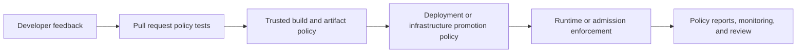

# Policy as Code Operating Model

## Purpose

Policy as code turns approved requirements into versioned, reviewable, testable, and observable decisions. Use it where a repository produces structured artifacts that a machine can evaluate consistently.

This is a reference pattern. Select policy engines, control scope, severity, rollout mode, and exceptions only after discovery of the real architecture, delivery platforms, team ownership, and risk.

Policy as code does not replace architecture review, threat modeling, secure development, vulnerability remediation, access control, change approval, or accountable risk acceptance.

## Cross-Repository Model

| Repository | Policy responsibility | Typical evaluated artifact | Example enforcement point |
| --- | --- | --- | --- |
| Application | build, test, dependency, license, and artifact handoff requirements | build metadata, scanner output, SBOM, provenance | pull request and trusted release CI |
| Deployment | workload security, immutable promotion, environment, and exception requirements | rendered Kubernetes, Helm, Kustomize, Compose, and GitOps definitions | pull request, promotion, and pre-sync |
| Infrastructure | destructive-change, public-exposure, encryption, identity, backup, and provider guardrails | Terraform/OpenTofu plan JSON, configuration, and Ansible content | plan review before apply |
| Platform | reusable policy bundles and runtime admission | Kubernetes admission requests and shared platform configuration | CI plus admission controller |
| Security | control intent, severity, exception contract, evidence, and risk ownership | control catalog and exception metadata | governance review and security gates |
| Monitoring | alert quality, severity, ownership, routing, and telemetry requirements | Prometheus rules, Alertmanager routes, dashboards, and collector configuration | pull request and configuration reload |
| Documentation | schema, link, public-safety, and decision-record quality | Markdown, diagrams, schemas, and indexes | documentation CI |

Do not duplicate the same policy independently in every repository. Security defines the requirement, platform maintains reusable implementations, and consuming repositories own local tests and integration.

## Policy Selection

Use the smallest engine that fits the artifact and enforcement point:

- native validators first, such as `terraform validate`, `kubectl` or Kustomize rendering, `helm lint`, `promtool`, and `amtool`;
- OPA or Conftest for structured files, Terraform plan JSON, build contracts, and organization-specific CI decisions;
- Kyverno for Kubernetes-native validation, mutation, generation, image verification, and policy reports;
- repository and organization settings for branch rules, required reviews, allowed actions, and full-SHA action pinning;
- cloud-native organization policies where enforcement must occur at the provider control plane.

A single organization may use more than one engine. Avoid translating every control into Rego or Kyverno when a maintained native validator already provides the required decision.

## Minimum Policy Contract

Every blocking policy should document:

- unique policy identifier and plain-language requirement;
- owner and reviewing team;
- scope, exclusions, and supported versions;
- severity and report, warn, or block behavior;
- positive, negative, and exception tests;
- remediation guidance;
- evidence or report location;
- rollout and rollback procedure;
- exception schema, approver, expiry, and review cadence;
- metrics for violations, false positives, bypasses, and policy health.

## Lifecycle

1. **Discover:** identify the asset, artifact, threat, current control, owner, and enforcement point.
2. **Define:** approve a plain-language requirement and measurable outcome.
3. **Implement:** encode the smallest reusable policy and pin compatible tooling.
4. **Test:** include positive, negative, boundary, and exception fixtures.
5. **Audit:** run without blocking and measure violations and false positives.
6. **Remediate:** fix non-compliant artifacts and document narrow exceptions.
7. **Enforce:** block only when ownership, remediation, rollback, and support are ready.
8. **Observe:** publish policy decisions and investigate missing or unexpected evaluations.
9. **Review:** reassess policy value, exceptions, versions, and bypass paths periodically.

## Enforcement Layers

Use defense in depth where risk justifies it:



- local checks provide fast feedback but are not authoritative;
- pull-request checks protect merge quality;
- trusted release workflows verify artifacts and provenance;
- deployment and infrastructure gates evaluate environment impact;
- admission or provider controls protect against direct changes and drift;
- monitoring confirms that policies are evaluating and enforcement remains healthy.

## Exceptions

Exceptions must be precise and time-bound. Store real approvals and environment values in private governance or implementation systems.

Minimum fields:

- `<EXCEPTION_ID>`;
- affected policy and exact resource identity;
- owner and risk owner;
- technical and business justification;
- compensating controls;
- approval reference;
- creation, review, and expiry dates;
- validation evidence;
- remediation or removal plan.

Never create wildcard exceptions for an entire cluster, environment, or repository when an exact workload or resource can be selected. Treat expired or malformed exceptions as policy violations.

## Testing Standard

- run native syntax and schema validation before policy evaluation;
- keep policy tests next to the policy code;
- require at least one allowed and one denied case;
- add an exception case when the policy supports exceptions;
- fail when no policy tests are discovered;
- pin policy-engine versions in real workflows;
- test policy-engine upgrades against the full fixture suite before rollout;
- test rendered artifacts, not only source templates;
- record skipped checks explicitly and never report them as passed.

Example local commands from the repository root:

```bash
conftest verify --policy repo-templates/app-repo/policies/conftest
conftest verify --policy repo-templates/deployment-repo/policies/conftest
conftest verify --policy repo-templates/infra-repo/policies/conftest
conftest verify --policy repo-templates/monitoring-repo/policies/conftest
kyverno test repo-templates/platform-repo/policies/kyverno/tests --require-tests
```

The Kyverno command requires a pinned, compatible CLI. Do not silently skip it when Kubernetes policy behavior is part of a release decision.

## Rollout Model

| Stage | Behavior | Exit criterion |
| --- | --- | --- |
| Draft | local tests only | requirement and owner approved |
| Audit | report violations, do not block | representative coverage and acceptable false-positive rate |
| Warn | visible developer or operator feedback | remediation and exception paths proven |
| Enforce | block non-compliant changes | support, rollback, observability, and governance approved |
| Retire | prevent new use and remove safely | replacement or control removal approved |

High-severity controls may use an accelerated rollout only with an explicit risk decision and tested rollback.

## Public-Safe Boundary

This repository contains only generic policies, synthetic fixtures, and placeholders. Keep the following private:

- real resource inventories and Terraform plans;
- customer, project, account, domain, IP, cluster, namespace, and repository identifiers;
- vulnerability evidence and incident data;
- exception approvals and risk decisions;
- credentials, tokens, kubeconfigs, state, and policy reports containing environment data.

## Official References

- [Open Policy Agent CI/CD guidance](https://www.openpolicyagent.org/docs/cicd)
- [Open Policy Agent policy testing](https://www.openpolicyagent.org/docs/policy-testing)
- [Kyverno policy testing](https://kyverno.io/docs/guides/testing-policies/)
- [Kyverno policy exceptions](https://kyverno.io/docs/guides/exceptions/)
- [GitHub Actions permissions](https://docs.github.com/en/actions/security-for-github-actions/security-guides/security-hardening-for-github-actions)
- [SLSA specification](https://slsa.dev/spec/v1.2/)
