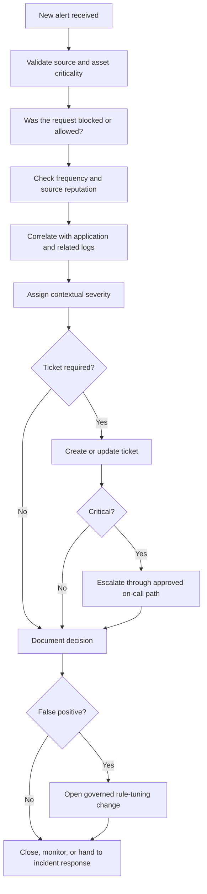

# Alert Triage Workflow

## Objective

Turn each actionable alert into a consistent, evidenced decision. The workflow does not authorize active response, blocking, host isolation, or external communication; those actions require the environment's approved incident process.

## Analyst Steps

1. **Receive and preserve context.** Record alert ID, time, agent, source log, decoder, rule ID, rule version, and notification route. Do not copy sensitive payloads into unapproved tickets or chat.
2. **Validate source and asset.** Confirm the agent is healthy, the log source is authoritative, time is synchronized, parsing is correct, and the asset owner and criticality are current.
3. **Check enforcement outcome.** Determine whether the WAF reports `blocked`, `allowed`, `challenged`, or only `observed`. Verify the meaning against the source product rather than trusting a label blindly.
4. **Assess frequency and origin.** Review the event count, time window, targeted paths, source attribution, proxy chain, and approved reputation sources. Treat IP reputation as context, not a verdict.
5. **Correlate.** Check WAF, reverse-proxy, application, identity, endpoint, IDS/IPS, and deployment-change evidence using the request ID and time window where available.
6. **Assign severity.** Combine confidence, outcome, asset criticality, exposure, persistence, successful effect, and business impact. Record why contextual severity differs from the rule level.
7. **Ticket.** Create or update a ticket when investigation, remediation, ownership transfer, trend follow-up, or exception review is required. Deduplicate related events.
8. **Escalate.** Use the approved on-call or incident-response path for confirmed or plausibly critical activity. Do not place credentials, customer data, or unrestricted raw logs in notifications.
9. **Tune carefully.** If the alert is a false positive or duplicate, open a scoped tuning change with evidence. Do not disable the detection directly from the triage queue.
10. **Document the decision.** Capture disposition, evidence references, owner, actions, timestamps, residual risk, follow-up date, and any linked detection change.

## Minimum Triage Record

| Field | Value |
| --- | --- |
| Alert/ticket reference | `<ALERT_OR_TICKET_ID>` |
| Environment and asset | `<ENVIRONMENT>` / `<ASSET_REFERENCE>` |
| Detection | `<RULE_ID_AND_VERSION>` |
| WAF outcome | `<BLOCKED_ALLOWED_CHALLENGED_OBSERVED>` |
| Contextual severity | `<CRITICAL_HIGH_MEDIUM_LOW_INFORMATIONAL>` |
| Disposition | `<TRUE_POSITIVE_FALSE_POSITIVE_BENIGN_EXPECTED_DUPLICATE_UNRESOLVED>` |
| Evidence references | `<APPROVED_PRIVATE_LINKS>` |
| Decision and rationale | `<CONCISE_RATIONALE>` |
| Owner and follow-up | `<OWNER_ROLE>` / `<FOLLOW_UP_DATE>` |

## Quality Checks

- A high rule level alone did not determine incident severity.
- The analyst verified whether the WAF actually blocked the request.
- Source attribution accounts for trusted proxies and user-controlled headers.
- Relevant application behavior and recent deployments were checked.
- A false-positive decision has enough evidence to tune safely.
- The record contains references, not unnecessary copies of sensitive raw data.
