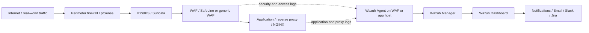
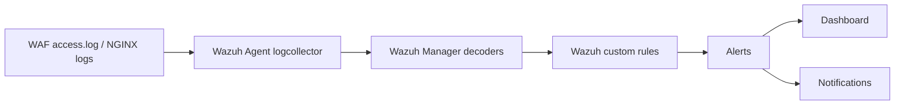

# Wazuh Reference Architecture

## Scope

This architecture illustrates one reusable pattern for correlating perimeter, WAF, reverse-proxy, and host telemetry. SafeLine is an example WAF deployment in Docker; it is not a required product. Replace every component and control boundary according to the approved architecture for `<ENVIRONMENT>`.

## Traffic and Monitoring Flow

The Wazuh agent is part of the monitoring path, not an inline traffic-control hop. pfSense, Suricata, and the WAF each retain their own prevention or detection responsibilities; Wazuh correlates selected evidence after collection.

## Log Processing Flow

## Trust and Ownership Boundaries

| Boundary | Design question | Expected owner |
| --- | --- | --- |
| Internet to perimeter | Which traffic is accepted, rejected, or inspected? | Network/security owner |
| Perimeter to WAF | Is TLS inspection, source attribution, and proxy trust configured correctly? | Network and platform owners |
| WAF to application | Can the application distinguish the trusted proxy from direct traffic? | Platform/application owners |
| Host to Wazuh Manager | How are agent identity, transport, enrollment, and certificate trust controlled? | SIEM/platform owner |
| Manager to dashboard/indexer | Who can administer, query, export, and delete security data? | `<SIEM_OWNER>` |
| Alert to notification system | Which fields may leave the SIEM and where are routing secrets stored? | Security and compliance owners |

## Reference Assumptions

- The implementation pins a supported stable Wazuh release and validates manager, indexer, dashboard, and agent compatibility before rollout. This blueprint's reviewed stable reference is 4.14.6, not the 5.0 beta.
- The WAF or application host can run a supported Wazuh agent and read the approved log files with least privilege.
- The log format is stable, timestamped, attributable to an asset, and documented by the source owner.
- Direct application access that bypasses the WAF is prevented or explicitly monitored.
- Time synchronization is reliable across firewall, IDS/IPS, WAF, application, manager, and ticketing systems.
- The manager, indexer, and dashboard design is sized and secured separately; a single diagram node does not imply a single-server deployment.
- Notification integrations send the minimum necessary alert data and reference secrets indirectly.

## Adaptation Decisions

Document these decisions before rollout:

- component products and supported versions;
- network zones, ports, trust anchors, and failure behavior;
- asset criticality and data classification;
- canonical WAF log schema and field normalization;
- high-availability and disaster-recovery objectives;
- retention, archival, deletion, and legal-hold requirements;
- monitoring, on-call, escalation, and rule ownership;
- validation evidence and rollback criteria.

This reference pattern does not prove production readiness. Complete threat modeling, failure-mode review, capacity testing, access review, the [hardening checklist](version-compatibility-and-hardening.md), and environment-specific acceptance testing first.
